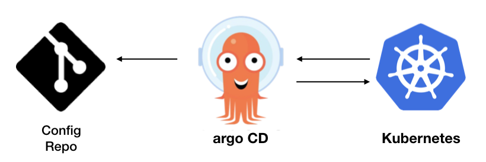

<h1 align="center">Fun with <a href="https://argoproj.github.io/">ArgoCD</a></h1>

<p align="center">
  
</p>

## Introduction

There are different ways to use ArgoCD in your pipeline. The following introduction
to one of these ways. The following way puts Helm chart besides the project and puts
its values into a different repository.

## Projects Pipelines

Each project that has helm, has two parts, one is the values and the other one is its chart.
We can develop chart in the project repository, which seems a reasonable choice, because then
you make sure chart is always updated with the changes in the code base.
Then create another repository for values
(let's call it the values' repository)
in which we have dependency to main chart.

```yaml
apiVersion: v2
name: saf-consumer
description: Queue with NATS Jetstream to remove all the erlangs from cloud

version: "0.0.0" # please note that this version is required

dependencies:
  - name: saf-consumer
    version: "1.2.0" # chart version not the application version
    repository: "https://1995parham.me/saf" # it must be a valid chart repository
```

And then our values placed in the values' repository:

```yaml
saf-consumer: # dependent chart name
  hello: 123
```

Finally we create an application for this chart on the ArgoCD and it easily syncs our values with the cloud.
In ArgoCD we have projects and under them we have applications.

```yaml
apiVersion: argoproj.io/v1alpha1
kind: Application
metadata:
  name: saf-consumer
spec:
  destination:
    namespace: nats-testing
    server: https://kubernetes.default.svc
  project: nats
  source:
    helm:
      valueFiles:
        - values.yaml
        - testing-teh1-okd.yaml
    path: saf-consumer
    repoURL: git@github.com:1995parham/saf-values
    targetRevision: HEAD
```

Also we can create an application set to deploy multiple application at the same time **even with discovery**.

```yaml
apiVersion: argoproj.io/v1alpha1
kind: ApplicationSet
metadata:
  name: bootstrap-testing
spec:
  generators:
    - git:
        repoURL: git@github.com:1995parham/saf-values
        revision: HEAD
        files:
          - path: "values.json"
  template:
    metadata:
      name: "{{ name }}"
    spec:
      destination:
        namespace: "{{ namespace.name }}"
        server: https://kubernetes.default.svc
      project: nats
      source:
        helm:
          valueFiles:
            - "./{{ namespace.type }}-{{ region }}-okd4.yaml"
        path: "{{ name }}"
        repoURL: git@github.com:1995parham/saf-values
        targetRevision: HEAD
```

and here the `values.json` which provide information about our ArgoCD applications that exists in our
values' repository:

```json
[
  {
    "name": "nats",
    "region": "teh1",
    "namespace": {
      "name": "nats-testing",
      "type": "testing"
    }
  },
  {
    "name": "saf-consumer",
    "region": "teh1",
    "namespace": {
      "name": "nats-testing",
      "type": "testing"
    }
  },
  {
    "name": "saf-producer",
    "region": "teh1",
    "namespace": {
      "name": "nats-testing",
      "type": "testing"
    }
  }
]
```
